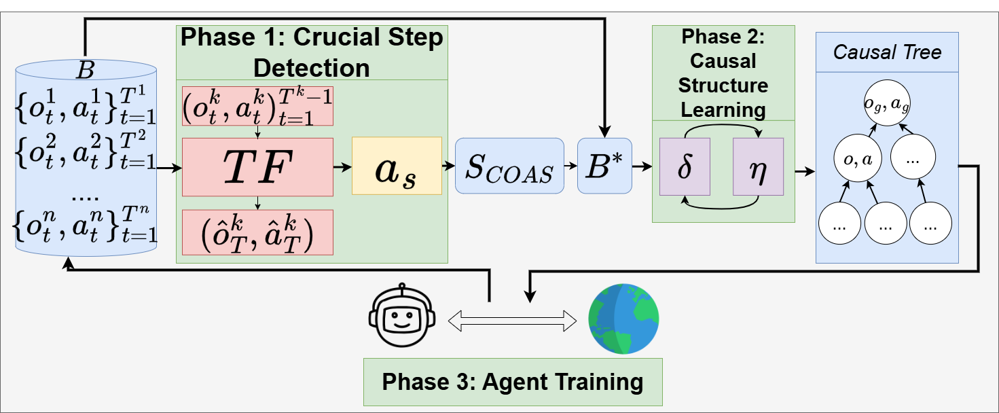

# Variable-Agnostic-Causal-Exploration-for-Reinforcement-Learning-VACERL

This is the codebase for the paper Variable-Agnostic-Causal-Exploration-for-Reinforcement-Learning published at ECML PKDD 2024 (link to paper: https://link.springer.com/chapter/10.1007/978-3-031-70344-7_13 or https://arxiv.org/pdf/2407.12437)



# Overview 
VACERL is a novel reinforcement learning algorithm designed to explore environments by leveraging variable-agnostic causal discovery techniques. This approach allows the agent to build a causal hierarchy, enhancing its ability to make informed decisions and improve learning efficiency.

# Instruction
## src/Causal_Discovery_Algorithm 
This directory includes the modules necessary for the causal discovery process:
- Attention: Identifies relevant variables for causal discovery.
- Causal Discovery: Discovers causal relationships among variables.
- Construct Causal Hierarchy Tree: Builds a hierarchy based on the discovered causal relationships.

## src/Environments 
This folder contains modified versions of environments used in our experiments, tailored to evaluate the performance of VACERL.

## Running VACERL
To run VACERL with a specific set of parameters, use the following command:

```bash
python main.py --env MG_1 --render-mode rgb_array --algorithm HER --seed_type multi --reward 0.0001 --buffer-size-causal-discovery 50 --number_attention 70 --state_diff_attention 0.9 --state_diff_policy 0.85 --alteration-index 10 --training_f 600 --training_s 600 --total_timestep 10000000 --head_timestep 500000 --loop 20
```

# Example 
You can also refer to this [link](https://github.com/mhngu23/Intrinsic-Reward-Motivati-Reinforcement-Learning-Re-Implementation/blob/main/Advanced_Method.ipynb) or [link](https://github.com/rl-memory-exploration-tutorial/rl-memory-exploration-tutorial.github.io/tree/main/resources/code/partC) for the notebook implementation of VACERL with visualization of a single run on FL environment.

# Citation
To cite the paper 

